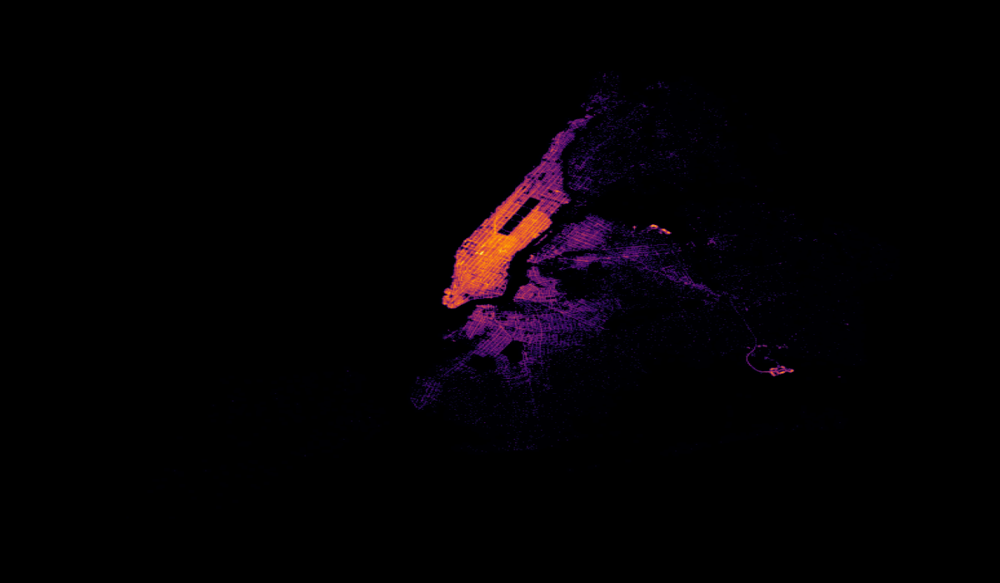
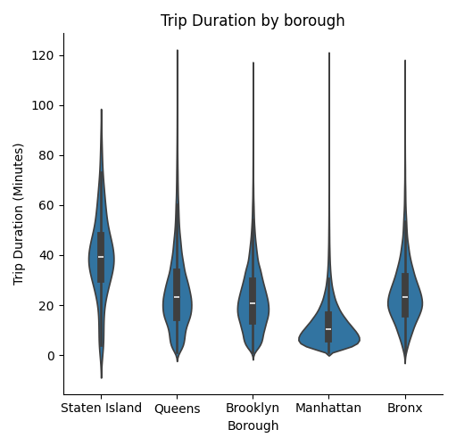
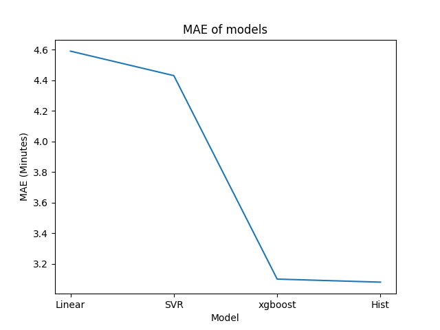

# NYC Taxi Duration

## About this project
New York city traffic can be hectic for some, and this project tries to use the 1.5m rows of data from the Kaggle real-time NYC taxi trip data to find the trip duration based on Pickup (long,lat) Dropoff (long,lat).

### Topics Covered by this project
- Data cleaning
- Exploratory Data Analysis
- Feature Engineering
- Experimenting and choosing the best performing ML model

> Dataset Used : NYC Taxi Trip Duration
https://www.kaggle.com/datasets/yasserh/nyc-taxi-trip-duration


> Hexbin Image of NYC based on data
### Data Cleaning
- Reading the raw data revealed some outliers
   -  Which might be caused by faulty reading of the data
   -  The longitude and latitude data were some outliers including
   the trip duration with the max trip duration lasting 40 days
- Those outliers were later removed , which only removed 1K data which was normal in a dataset of 1.5m rows


### Exploratory Data Analysis and Feature Engineering
- Only the longitude and latitude columns were useful at first in the data
- And new features were later created using haversine distance formula to calculate distance between the pickup and dropoff points as a feature

$$
\begin{aligned}
a &= \sin^2\left(\frac{\Delta \varphi}{2}\right) + \cos(\varphi_1) \cos(\varphi_2) \sin^2\left(\frac{\Delta \lambda}{2}\right) \\
c &= 2 \arcsin\left(\sqrt{a}\right) \\
d &= R \cdot c
\end{aligned}
$$
- Also the NYC geojson data was used to classify the rows by borough which added extra signal for the models to learn
- New features 
    |Name|Dtype|
    |----|-----|
    |Distance|float|
    |Borough| categorical|

> Taxi trip duration by borough
### Model and Performance



| Model | MAE(minutes) |
|-------|------|
| Linear | 4.59 |
| SVR | 4.43 |
| XGBoost | 3.10 |
| HistGradientBoosting | 3.08 |

> HistGradientBoosting is selected as the final model based on the lowest Mean Absolute Error

- The dataset was split into an 80/20 train/test split
- Model selection was based on performance on the holdout test set

## Setup

```bash
git clone https://github.com/IoannisDev/NYC-Taxi-Duration.git
cd NYC-Taxi-Duration
python -m venv venv
source venv/bin/activate
pip install -r requirements.txt
```

> **Dataset:** Download [NYC Taxi Trip Duration](https://www.kaggle.com/datasets/yasserh/nyc-taxi-trip-duration) from Kaggle and place the CSV at `data/raw/NYC.csv` before running the pipeline.

## Usage

### 1. Process data

Place the raw dataset at `data/raw/NYC.csv`, then run:

```bash
python src/data/make_dataset.py
```

### 2. Train the model

```bash
python src/model/train_model.py
```

### 3. Predict

**Batch** — pass a CSV file and get predictions saved to a CSV:

```bash
python src/model/predict_model.py --input <path/to/input.csv> --output <path/to/output.csv>
```

**Interactive** — enter a single trip's details at the prompt:

```bash
python src/model/predict_model.py
```

**Optional flags:**

| Flag | Description | Default |
|------|-------------|---------|
| `--input`, `-i` | Input CSV for batch prediction | — |
| `--output`, `-o` | Output CSV path | `results/predictions.csv` |
| `--model`, `-m` | Path to trained model `.pkl` | `models/hist_model.pkl` |
| `--geojson` | Path to NYC boroughs GeoJSON | `data/processed/boundary.geojson` |

## Project Structure

```
├── data/
│   ├── raw/                  # Raw input data
│   ├── interim/              # Intermediate data
│   └── processed/            # Cleaned, model-ready data
├── models/                   # Saved model files
├── notebook/                 # EDA and experiment notebooks
├── reports/figures/          # Generated plots and figures
├── src/
│   ├── data/                 # Data processing scripts
│   ├── model/                # Training and prediction scripts
│   └── ...
├── config.yml                # Project configuration
└── requirements.txt
```
